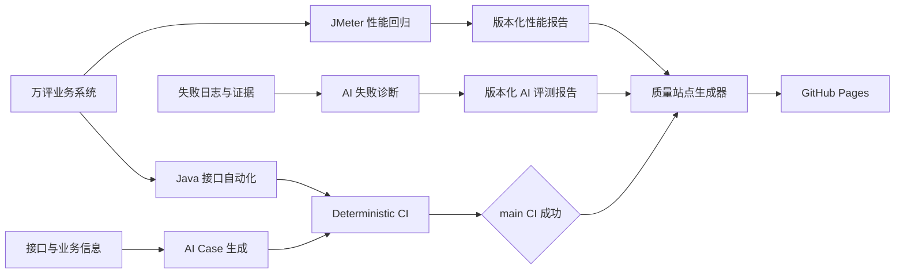

# 万评 AI 测试与质量工程

[](https://github.com/huihuizhou00/wanping-api-test/actions/workflows/ai-diagnosis-eval.yml) [](https://github.com/huihuizhou00/wanping-api-test/actions/workflows/ci.yml) [](https://github.com/huihuizhou00/wanping-api-test/actions/workflows/quality-report-cd.yml)

## 项目简介

本项目面向万评生活服务系统，构建覆盖 Java 接口自动化、AI 测试用例生成、失败诊断评测、JMeter 性能回归、CI 质量门禁和 GitHub Pages 质量报告发布的测试开发体系。

项目实现从测试设计、自动执行、失败诊断、效果评测、性能验证到结果交付的完整闭环。

## 核心能力

| 模块 | 主要能力 |
|---|---|
| 接口自动化 | RestAssured、JUnit 5、统一 Client、测试数据与环境配置 |
| AI Case | 根据接口与业务信息生成结构化测试用例，并支持需求追踪和人工评审 |
| AI 失败诊断 | 根据失败证据生成结构化原因与建议，并通过标准样本评测诊断效果 |
| 性能回归 | JMeter 多轮 Baseline/Candidate 对比、阈值门禁和 JSON/Markdown 报告 |
| 业务一致性 | 校验库存、订单、一人一单、重复订单、恢复与补偿状态 |
| CI | GitHub Actions 执行仓库安全、Python、Java 编译和质量站点测试 |
| CD | `main` 的确定性 CI 成功后自动发布 GitHub Pages 质量报告 |

## 整体架构



详细说明：

- [总体测试架构](docs/architecture/testing-architecture.md)
- [AI 测试流程](docs/architecture/ai-testing-flow.md)
- [CI/CD 流程](docs/architecture/ci-cd-flow.md)
- [性能回归流程](docs/architecture/performance-regression-flow.md)

## 项目目录

```text
wanping-api-test/
├── src/test/                         Java 接口自动化
├── ai-case-generator/                AI Case 生成与校验
├── scripts/performance/              性能回归脚本
├── scripts/reports/                  质量站点生成与安全检查
├── performance/                      Baseline、Candidate 和测试计划
├── quality-site/                     报告 Manifest 与 CSS
├── docs/test-results/                版本化测试结果
├── docs/architecture/                架构与流程文档
└── .github/workflows/                CI 与 CD 工作流
```

## 快速开始

### 1. Java 测试代码编译

```bash
mvn \
  --batch-mode \
  --no-transfer-progress \
  -DskipTests \
  test-compile
```

### 2. AI Case Generator 测试

```bash
cd ai-case-generator

python3 -m unittest discover \
  -s tests \
  -p "test_*.py" \
  -v
```

### 3. 性能工具测试

```bash
python3 -m unittest discover \
  -s scripts/performance/tests \
  -p "test_*.py" \
  -v
```

### 4. 质量站点测试

```bash
python3 -m unittest discover \
  -s scripts/reports/tests \
  -p "test_*.py" \
  -v
```

### 5. 本地生成质量站点

```bash
PUBLISHED_AT="$(
  date -u +%Y-%m-%dT%H:%M:%SZ
)"

python3 scripts/reports/build_quality_site.py \
  --repository-root . \
  --manifest quality-site/report-manifest.json \
  --output build/quality-site \
  --commit-sha "$(git rev-parse HEAD)" \
  --branch "$(git branch --show-current)" \
  --publish-mode local \
  --ci-run-url "" \
  --published-at "$PUBLISHED_AT" \
  --repository wanping-api-test

python3 scripts/reports/check_quality_site.py \
  --site build/quality-site
```

生成入口：

```text
build/quality-site/index.html
```

## AI 测试

### AI Case 生成与评审

AI Case 模块将接口信息和业务约束转换为结构化测试用例，并保留需求追踪关系。生成结果进入人工评审，记录入选、修改和拒绝原因。

版本化评审结果位于：

```text
docs/test-results/day12-ai-case-review/
```

### AI 失败诊断

失败诊断模块从测试失败证据中提取关键信息，生成结构化原因、排查建议和修复方向。

`AI Diagnosis Evaluation` 使用 Self-hosted Runner 和 Ollama 独立运行。该工作流不作为 Pull Request 阻断门禁，避免本地 Runner 离线或模型波动阻塞确定性 CI。

版本化评测结果位于：

```text
docs/test-results/day13-ai-diagnosis/
```

## 性能回归

性能回归采用：

```text
安全测试数据准备
→ Baseline 三轮
→ Candidate 三轮
→ 中位数汇总
→ 性能门禁
→ 业务一致性门禁
→ JSON/Markdown 报告
```

### 商铺查询

| 指标 | Baseline | Candidate |
|---|---:|---:|
| 吞吐量 | 209.205 RPS | 213.447 RPS |
| P95 | 8 ms | 8 ms |
| P99 | 16 ms | 9 ms |
| 错误率 | 0% | 0% |

最终状态：`PASS`

### 秒杀 Plus

| 指标 | Baseline | Candidate |
|---|---:|---:|
| 吞吐量 | 4.238 RPS | 4.219 RPS |
| P95 | 3082 ms | 3054 ms |
| 订单数 | 20 | 20 |
| 重复订单数 | 0 | 0 |

最终状态：`PASS`

当前约 3 秒响应时间包含应用层异步订单确认等待，不能直接解释为 Lua 或 Redis 原子校验本身耗时。

## CI 质量门禁

`.github/workflows/ci.yml` 的工作流名称为：

```text
Deterministic CI
```

主要 Job：

```text
Repository safety
Python AI test generator
Java test compile
Quality site tests
```

该工作流用于 Pull Request Required Checks 和 `main` 合并结果验证。

## GitHub Pages CD

`.github/workflows/quality-report-cd.yml` 的工作流名称为：

```text
Quality Report CD
```

自动链路：

```text
main 上的 Deterministic CI 成功
→ workflow_run
→ 检出 workflow_run.head_sha
→ 构建质量站点
→ 安全检查
→ 上传 Pages Artifact
→ 部署 GitHub Pages
```

自动发布保证：

```text
CI 验证 Commit
=
CD 构建 Commit
=
Pages 展示 Commit
```

同时提供 `workflow_dispatch`，用于 Pages 发布失败后的手动重试。

## 安全边界

质量站点采用显式 Manifest 白名单，不扫描整个仓库。

禁止发布：

```text
JTL
Token CSV
jmeter.log
console.log
.env
私钥
Bearer Token
密码和 API Key
```

CD 不执行真实压测，不连接 MySQL、Redis、RocketMQ 或 Ollama，也不修改业务数据。

## 版本化报告

- [商铺查询性能报告](docs/test-results/day15-performance/shop-query-regression.md)
- [秒杀 Plus 性能报告](docs/test-results/day15-performance/seckill-plus-regression.md)
- [AI Case 人工评审](docs/test-results/day12-ai-case-review/review-summary.md)
- [AI 失败诊断评测](docs/test-results/day13-ai-diagnosis/baseline-v2/diagnosis-evaluation.md)

## 项目亮点

- 将接口测试、AI 测试和性能回归统一到质量工程体系中；
- 通过确定性 CI 设置代码合并门禁；
- 将非确定性 Ollama 评测与 Required Checks 解耦；
- 使用多轮中位数减少性能回归偶然波动；
- 将性能指标与业务一致性同时纳入秒杀门禁；
- 使用 `workflow_run.head_sha` 保证 CI/CD 发布版本一致；
- 自动发布可访问、可追踪的 GitHub Pages 质量报告。

