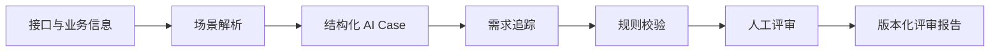
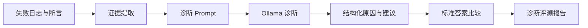

# AI 测试流程

## AI Case 生成

```mermaid
flowchart LR
    A[接口与业务信息]
    --> B[场景解析]
    --> C[结构化 AI Case]
    --> D[需求追踪]
    --> E[规则校验]
    --> F[人工评审]
    --> G[版本化评审报告]
```

AI 生成结果必须经过结构校验和人工评审，不能直接替代确定性测试代码。

## AI 失败诊断

```mermaid
flowchart LR
    A[失败日志与断言]
    --> B[证据提取]
    --> C[诊断 Prompt]
    --> D[Ollama 诊断]
    --> E[结构化原因与建议]
    --> F[标准答案比较]
    --> G[诊断评测报告]
```

`AI Diagnosis Evaluation` 使用 Self-hosted Runner 独立执行。其结果用于评测和观察，不阻塞 Pull Request 的确定性质量门禁。
