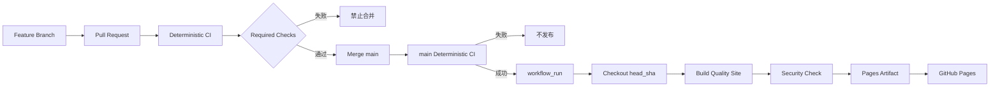

# CI/CD 流程

## 流程图

## CI 与 CD 边界

### Deterministic CI

负责：

- 仓库安全检查；
- Python 测试；
- Java 测试代码编译；
- 质量站点生成器测试；
- 本地质量站点构建与检查。

### Quality Report CD

负责：

- 接收 `main` 上成功的 CI 事件；
- 检出 `workflow_run.head_sha`；
- 生成质量站点；
- 上传 Pages Artifact；
- 发布 GitHub Pages。

CD 不连接业务数据库，也不执行真实 JMeter 或 Ollama。
