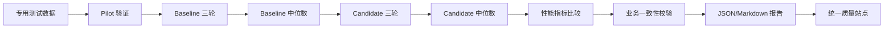

# 性能回归流程

## 流程图

## 商铺查询门禁

关注：

- 样本数；
- 错误率；
- 吞吐量；
- P95；
- P99；
- 最大响应时间。

## 秒杀 Plus 门禁

除性能指标外，还校验：

- 数据库和 Redis 库存；
- 订单数；
- 独立用户数；
- 重复订单；
- 库存扣减与恢复日志；
- 补偿和对账任务；
- 残留请求键。

秒杀 Plus 的约 3 秒响应时间包含异步订单确认等待，不代表 Lua 或 Redis 原子操作耗时。
