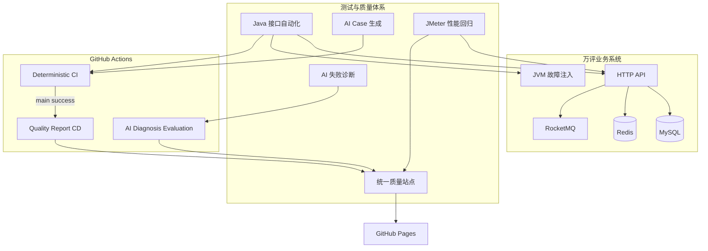

# 万评测试体系总体架构

## 架构图

```mermaid
flowchart TB
    subgraph SUT[万评业务系统]
        API[HTTP API]
        MYSQL[(MySQL)]
        REDIS[(Redis)]
        MQ[RocketMQ]
        JVM[JVM 故障注入]
    end

    subgraph TEST[测试与质量体系]
        JAVA[Java 接口自动化]
        CASE[AI Case 生成]
        DIAG[AI 失败诊断]
        PERF[JMeter 性能回归]
        REPORT[统一质量站点]
    end

    subgraph PIPELINE[GitHub Actions]
        CI[Deterministic CI]
        AIWF[AI Diagnosis Evaluation]
        CD[Quality Report CD]
    end

    JAVA --> API
    PERF --> API
    API --> MYSQL
    API --> REDIS
    API --> MQ
    JAVA --> JVM

    CASE --> CI
    JAVA --> CI
    DIAG --> AIWF
    PERF --> REPORT
    AIWF --> REPORT
    CI -->|main success| CD
    CD --> REPORT
    REPORT --> PAGES[GitHub Pages]
```

## 分层职责

- Java 接口自动化验证业务接口行为；
- AI Case 提升测试设计覆盖和需求追踪能力；
- AI 失败诊断辅助分析失败原因，但不替代确定性断言；
- JMeter 验证性能变化和秒杀业务一致性；
- Deterministic CI 负责合并质量门禁；
- Quality Report CD 负责发布版本化质量证据。
